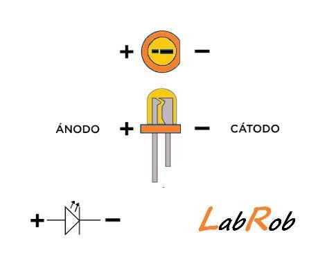

## CLase 23 de septiembre
### Arduino
Revision de corriente    
Corriente =  flujo de electrones [V]    
V = I*R    
una pata de arduino entrega 5 [V], 20-40 [mA]    
-> carga + = ánodo    
    -> carga - = cátodo    
 
