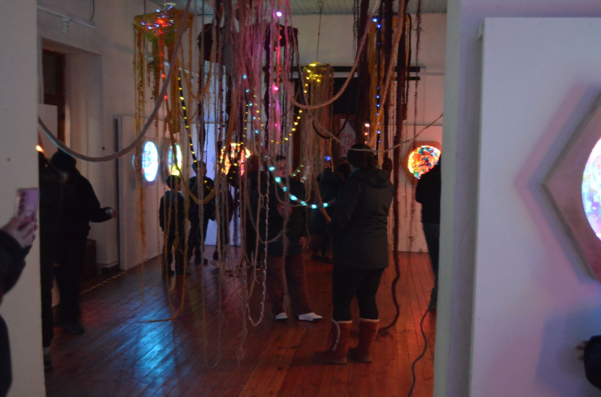
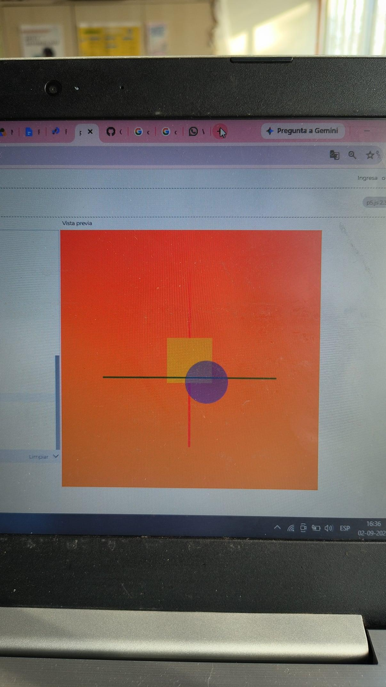

# Bitácora Nicole Renata 
## Statement
Creo en el arte como una herramienta para cuestionar, plantear preguntas y contar eso que cada artista considere importante; un contexto, una experiencia, una curiosidad o sólo una inquietud. Desde ahí trabajo, también desde mis convicciones, de que la naturaleza tiene un valor que va más allá de la utilidad que pueda tener para los humanos.

Respecto a mi trabajo, me interesa explorar el territorio, los procesos naturales y las relaciones que construimos con aquello que nos rodea. Me interesa cuestionar las formas en que hemos aprendido a nombrar y clasificar la naturaleza, y cómo estas formas de mirar terminan también definiendo nuestra manera de relacionarnos con ella. A través de instalaciones, objetos textiles, biomateriales y materiales recuperados y reciclados, busco generar nostalgia y cuestionamiento frente a aquello que muchas veces damos por sentado.

Creo en el hacer como una forma de pensar, acercarme a los materiales, conocer su origen, cómo han sido utilizados me permite comprender mejor lo que quiero abordar. El material, además de ser una herramienta para construir, es una forma de investigar y decir.

*“¿Tiene derecho el hombre a sacrificar sus tesoros naturales en beneficio del progreso? No lo creo”.* (Juan Carlos Bodoque, 31 minutos)

## Obra/Ejercicio 

## Artistas referentes
### Gilberto Esparza (México)
La obra de Gilberto Esparza se centra en el uso de medios electrónicos y robóticos para investigar los impactos de la tecnología en la vida cotidiana, las relaciones sociales, el medio ambiente y la estructura urbana. Su trabajo se realiza en colaboración con biólogos, botánicos y otros científicos lo que resulta en dispositivos y propuestas que diluyen la frontera entre ciencia y arte.
#### Plantas Nómadas (2008-2014)
Plantas Nómadas es un proyecto de investigación que surge de reflexionar sobre los impactos ambientales y sociales que genera la actividad humana. Son organismos simbióticos construidos por un sistema robótico, una especie de vegetal orgánica y un conjunto de celdas de combustible microbianas y fotovoltaicas. Se trata de una especie autónoma cuyo ciclo metabólico tiene el potencial de restaurar a pequeña escala los daños ecológicos del entorno al restituir la energía que toma de la tierra. Al encontrar agua contaminada, la succiona y almacena en un grupo de celdas microbianas en las que las bacterias y microorganismos autóctonos se ocupan de biodegradar los deshechos orgánicos y transformar sustancias tóxicas. Este proceso metabólico genera electricidad que es almacenada mediante un sistema de cosecha de energía para cargar un conjunto de bacterias. El proceso de biodegradación mejora la calidad del agua, proporcionándola a las especies vegetales que habitan en ella. La planta nómada sobrevive en ambientes afectados por la contaminación del agua, principalmente en sonaste desastre ecológico afectadas por industrias y los deshechos de grandes centros urbanos.

**Interés en la obra**: Dentro del bioarte hay una mirada positiva sobre las problemáticas que aborda, proponiendo distintas posibilidades, pero no necesariamente soluciones, en este caso si plantea una respuesta, usando diversos organismos que co-existen dentro de un sistema que busca limpiar y descontaminar un lugar, haciéndose parte del entorno y generando relaciones.

“Vivir-con y morir-con de manera recíproca y vigorosa en el Chthuluceno puede ser una respuesta feroz a los dictados del Ántropos y el Capital”.  (“Seguir con el problema”, Haraway, p.21). Interpretando esta frase, debemos aprender a convivir con el entorno y entender que somos parte de ello. Vivir-con implica asumir nuestra coexistencia y responsabilidad dentro de los ecosistemas que habitamos.

[ Video Plantas Nomadas](http://youtube.com/watch?v=US9q2ayKANk)

### Claudia González (Chile)
Es artista medial independiente y gestora de proyectos educativos en arte y tecnología. Su obra se centra en la noción de materialidad de soportes tecnológicos tanto analógicos como digitales, así como en el comportamiento de los materiales en el tiempo y su manifestación en la dimensión del sonido. A lo largo de su carrera, ha explorado las relaciones entre arte, ciencia, naturaleza y tecnología, tanto en su labor como artista y docente. Desarrollando metodologías de trabajo, investigación y producción centradas en el agua, los ríos y la tierra. A partir de allí, vincula el objeto tecnológico como medio para explorar sus intereses en la ecología al experimentar con materias minerales, orgánicas, electrónica y sonido para propiciar experiencias de colaboración interdisciplinaria entre la arquitectura, el arte y las humanidades ambientales.
#### Hidroscopia
CGG: Las hidroscopias analizan el fenómeno del extractivismo hídrico, es decir, cómo los ríos están siendo intervenidos para la extracción y utilización de sus aguas, principalmente en la industria minera e hidroeléctrica. Entonces, la relación entre tecnología y naturaleza emerge desde la violencia que genera la intervención humana sobre estos cuerpos de agua a través del uso de tecnologías extractivas. Y, en este sentido, ya sabiendo el gran impacto que produce la industria sobre los ríos y sus ecosistemas, comienzo a preguntarme cuál es la dimensión sensible a partir de la cual los artistas podemos convocar una reflexión. Ahí pienso que la tecnología no tiene por qué ser invasiva: igualmente podemos desarrollar vínculos entre naturaleza y tecnología de formas no complejas. 

**Interés en la obra**: La serie _Hidroscopías_ reflexiona sobre el vínculo entre la naturaleza y las personas, mostrando las diferentes formas en que nos relacionamos con un cauce o con un territorio. También muestra y se acompaña de una comunidad activa en la defensa de estos lugares. La forma y los materiales utilizados en sus ensambles hablan del territorio de una manera potente, haciendo que la materialidad también se convierta en una forma de contar y relacionarse con el lugar.

Hidroscopia/Loa (2018)

Hidroscopia/Mapocho (2016)

### Yto Aranda (Chile)

La obra de Yto Aranda se desarrolla en torno a las relaciones entre naturaleza, tecnología y territorio. Sus procesos parten de investigaciones prolongadas en lugares específicos, donde observa, registra y experimenta con distintos fenómenos naturales para luego traducirlos mediante materiales, sonido, luz y dispositivos tecnológicos.

#### ~~~desde la raíz~~~
Esta obra surge de una investigación realizada en el bosque esclerófilo de Rao Caya, en Alhué, a partir de la observación y registro de su flora, fauna y funga, además de la investigación de las relaciones que ocurren bajo el suelo entre raíces y micorrizas. A partir de este proceso, Aranda construye una instalación que busca hacer perceptible esta red de conexiones mediante estructuras tejidas con fibras, luz, sonido y sensores.

**Interés en la obra**: Me interesa cómo Yto transforma una investigación territorial de años. En **Desde la raíz**, el estudio del bosque esclerófilo y de las relaciones subterráneas entre raíces y micorrizas se traduce mediante tejido, luz, sonido y tecnología. El tejido, particularmente, deja de ser solamente una técnica para convertirse en una forma de representar y pensar la interconexión del ecosistema. Utiliza Arduino, sensores de presencia y tacto, iluminación LED, sonido y video para generar una instalación interactiva, buscando traducir y hacer perceptibles relaciones que ocurren en el bosque y que normalmente permanecen ocultas.

Visita niños colegio de Pichi (Alhué) a exposición en Pichidegua (2025)

## Tecnologías electrónico/digitales/computacionales
### 

## Clase 12 de Agosto
### Visita de Sean Moscoso
1. ¿qué nueva herramienta, o aproximación computacional, reconociste luego de la visita de sean?  
Sonic Pi
Pure Data 

3. ¿qué te despertó su trabajo en relación a tu propia obra? ¿te llamó su trabajo la atención lo suficiente para considerar incorporar nuevos elementos, textos, etc?  
Me llamó la atención algo con lo que trabajo pero intento evitar, la aletoriedad y la improvisación, Sean incorpora gran parte de estos elementos en su proceso, trabajando e improvisando en vivo, lo que hace que los resultados sean difíciles de repetir y que cada experiencia pueda generar una combinación distinta. Quizás podría incorporar y aceptar más esa posibilidad dentro de mi proceso, entendiendo que no todo tiene que estar previamente definido y que pueden aparecer resultados inesperados que también formen parte de la obra, especialmente porque trabajo constantemente con la naturaleza y el territorio, elementos que no pueden ser completamente controlados.

4. ¿qué nuevos referentes artísticos conociste?  
Huber Duprat
Nicolás Briceño
Gyorgy Ligeti (poema para 100 metrónomos)

## Clase 19 de Agosto
### Processing
//Trabajando con p5 porque no puedo descargar processing

### Ejercicio/constructivismo ruso

## Clase 26 de Agosto 
### Visita de Aarón Montoya

## Clase 2 de Septiembre
Trabajo en processing con Mónica Bate, revisamos distintas funciones y referencias.  
**no alcancé a guardar el código en p5**

Ejercicio de la clase, para manejo de referencias.
  
Lo que alcancé a sacar de ese día
