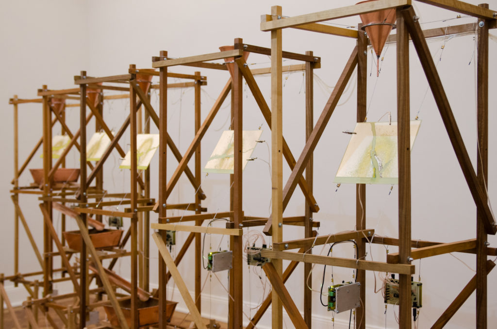
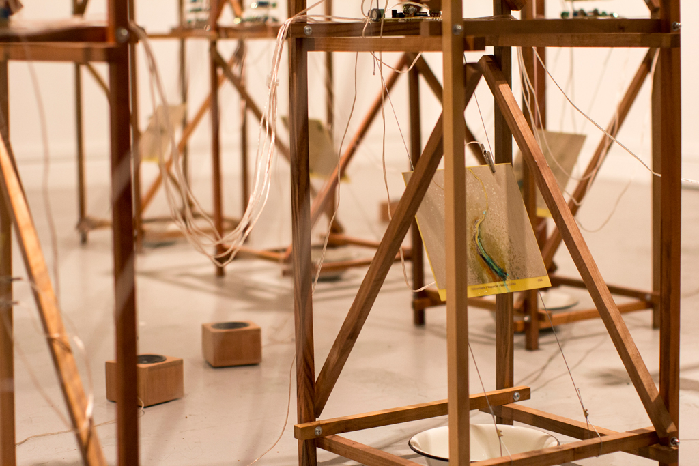

# Bitácora Nicole Renata 
## Statement
Creo en el arte como una herramienta para cuestionar, plantear preguntas y contar eso que cada artista considere importante; un contexto, una experiencia, una curiosidad o sólo una inquietud. Desde ahí trabajo, también desde mis convicciones, de que la naturaleza tiene un valor que va más allá de la utilidad que pueda tener para los humanos.

Respecto a mi trabajo, me interesa explorar el territorio, los procesos naturales y las relaciones que construimos con aquello que nos rodea. Me interesa cuestionar las formas en que hemos aprendido a nombrar y clasificar la naturaleza, y cómo estas formas de mirar terminan también definiendo nuestra manera de relacionarnos con ella. A través de instalaciones, objetos textiles, biomateriales y materiales recuperados y reciclados, busco generar nostalgia y cuestionamiento frente a aquello que muchas veces damos por sentado.

Creo en el hacer como una forma de pensar, acercarme a los materiales, conocer su origen, cómo han sido utilizados me permite comprender mejor lo que quiero abordar. El material, además de ser una herramienta para construir, es una forma de investigar y decir.

*“¿Tiene derecho el hombre a sacrificar sus tesoros naturales en beneficio del progreso? No lo creo”.* (Juan Carlos Bodoque, 31 minutos)

## Obra/Ejercicio 

## Artistas referentes
### Gilberto Esparza (México)
La obra de Gilberto Esparza se centra en el uso de medios electrónicos y robóticos para investigar los impactos de la tecnología en la vida cotidiana, las relaciones sociales, el medio ambiente y la estructura urbana. Su trabajo se realiza en colaboración con biólogos, botánicos y otros científicos lo que resulta en dispositivos y propuestas que diluyen la frontera entre ciencia y arte.
#### Plantas Nómadas (2008-2014)
Plantas Nómadas es un proyecto de investigación que surge de reflexionar sobre los impactos ambientales y sociales que genera la actividad humana. Son organismos simbióticos construidos por un sistema robótico, una especie de vegetal orgánica y un conjunto de celdas de combustible microbianas y fotovoltaicas. Se trata de una especie autónoma cuyo ciclo metabólico tiene el potencial de restaurar a pequeña escala los daños ecológicos del entorno al restituir la energía que toma de la tierra. Al encontrar agua contaminada, la succiona y almacena en un grupo de celdas microbianas en las que las bacterias y microorganismos autóctonos se ocupan de biodegradar los deshechos orgánicos y transformar sustancias tóxicas. Este proceso metabólico genera electricidad que es almacenada mediante un sistema de cosecha de energía para cargar un conjunto de bacterias. El proceso de biodegradación mejora la calidad del agua, proporcionándola a las especies vegetales que habitan en ella. La planta nómada sobrevive en ambientes afectados por la contaminación del agua, principalmente en sonaste desastre ecológico afectadas por industrias y los deshechos de grandes centros urbanos.

Interes en la obra...

[ Video Plantas Nomadas](http://youtube.com/watch?v=US9q2ayKANk)

### Claudia González (Chile)
Es artista medial independiente y gestora de proyectos educativos en arte y tecnología. Su obra se centra en la noción de materialidad de soportes tecnológicos tanto analógicos como digitales, así como en el comportamiento de los materiales en el tiempo y su manifestación en la dimensión del sonido. A lo largo de su carrera, ha explorado las relaciones entre arte, ciencia, naturaleza y tecnología, tanto en su labor como artista y docente. Desarrollando metodologías de trabajo, investigación y producción centradas en el agua, los ríos y la tierra. A partir de allí, vincula el objeto tecnológico como medio para explorar sus intereses en la ecología al experimentar con materias minerales, orgánicas, electrónica y sonido para propiciar experiencias de colaboración interdisciplinaria entre la arquitectura, el arte y las humanidades ambientales.
#### Hidroscopia
CGG: Las hidroscopias analizan el fenómeno del extractivismo hídrico, es decir, cómo los ríos están siendo intervenidos para la extracción y utilización de sus aguas, principalmente en la industria minera e hidroeléctrica. Entonces, la relación entre tecnología y naturaleza emerge desde la violencia que genera la intervención humana sobre estos cuerpos de agua a través del uso de tecnologías extractivas. Y, en este sentido, ya sabiendo el gran impacto que produce la industria sobre los ríos y sus ecosistemas, comienzo a preguntarme cuál es la dimensión sensible a partir de la cual los artistas podemos convocar una reflexión. Ahí pienso que la tecnología no tiene por qué ser invasiva: igualmente podemos desarrollar vínculos entre naturaleza y tecnología de formas no complejas. 

Interes en la obra...

Hidroscopia/Loa (2018)

Hidroscopia/Mapocho (2016)
